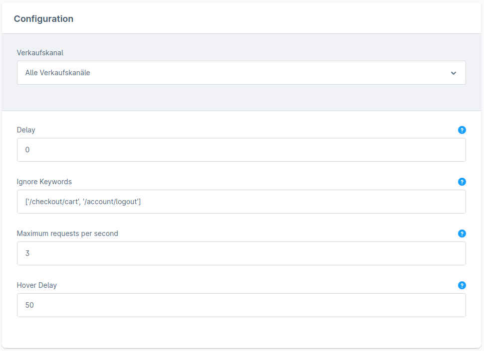

# Shopware 6 links prefetching with Flying Pages

Flying Pages prefetch pages before the user click on links, making them load instantly

[Flying Pages Script](https://github.com/gijo-varghese/flying-pages)

## Default config

## How it Works?

Flying Pages injects a tiny JavaScript code (1KB gzipped), waits until the browser becomes idle. Then it detects pages in the viewport and on mouse hover and prefetch them.

Flying Pages is intelligent to make sure prefetching doesn't crash your server or make it slow.

- **Prefetch pages in the viewport** - Detect links within the viewport (current viewing area) using 'Intersection Observer' and tells the browser to prefetch them using 'prefetch', switch to xhr if not available (similar to [Quicklink](https://github.com/GoogleChromeLabs/quicklink)).

- **Prefetch pages on mouse hover** - On hovering links, if it's not prefetched yet using above 'viewport', then Flying Pages will prefetch them instantly (similar to [Instant page](https://instant.page/)).

- **Limits the number of prefetch per second** - If your page has too many links, prefetching all at the same time will cause the server to crash or slow down the website to visitors. Flying Pages limits the number of prefetchs per second (3 req/sec by default) using an in-built queue. For example, if you've 10 links in the viewport, prefetching all these are span into 4 seconds.

- **Stops prefetching if the server is busy** - In case the server starts to respond slowly or return errors, prefetching will be stopped to reduce the server load.

- **Understands user's connection and preferences** - Checks if the user is on a slow connection like 2G or has enabled data-saver. Flying Pages won't prefetch anything in this case.